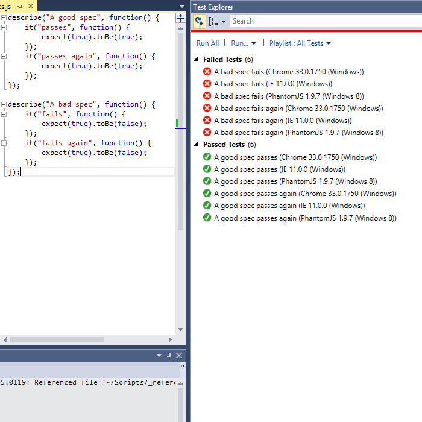

Cross-browser Karma JavaScript test results in Visual Studio Test Explorer
=========

[](http://www.youtube.com/watch?v=-28j6Ek8D7w)


Installation and Setup
===

1. Install the XML Test Adapter from [Visual Studio Gallery](http://visualstudiogallery.msdn.microsoft.com/bfe6feb7-7ec4-4e8e-9d90-cf6ea2cd2169)
2. Install/download nodejs (I grabbed the exe [from here](http://nodejs.org/dist/) and added it to my PATH)
3. Install/download npm (I grabbed the zip [from here](http://nodejs.org/dist/npm/) and put it in the same folder as node.exe)
4. Optionally install node modules globally
   1. ```npm install -g karma```
   2. ```npm install -g karma-ie-launcher``` _(required only if you want to test in IE)_
   3. ```npm install -g karma-xml-reporter```

Usage
===
1. Create/navigate to the folder that contains/will contain your tests
2. If you didn't install the npm modules globally, install them here
   1. ```npm install karma```
   2. ```npm install karma-ie-launcher``` _(required only if you want to test in IE)_
   3. ```npm install karma-xml-reporter```
3. Create a karma config file in the folder with your tests
   1. ```.\node_modules\.bin\karma init```
   2. _answer the questions, for example:_
      1. Test framework: jasmine
      2. RequireJS: No
      2. Browsers: Chrome, IE, PhantomJS
      3. Test files: *Specs.js
      4. Exclusions: _(none)_
      5. Watch for changes: Yes
4. Open up the generated karma.config.js in your text editor and add 'xml' as a reporter
   - ```reporters: ['progress', 'xml']``` becomes ```reporters: ['progress']```
5. Open Visual Studio and create a project that lives in the folder that contains your tests/karma config file
   - I usually always choose File -> Open Web Site and choose the FileSystem option, pointing at the folder
6. Create a simple test we can use to verify everything works. The filename must match the filter you gave to ```karma init``` earlier (eg. ```MyTestSpecs.js```)
   - ```describe("a test", function() {
            it("passes", function() {
                expect(true).toBe(true);
            });
        });```
7. From the command line, start karma
   - ```.\node_modules\.bin\karma start```
   - note: This will fire up the browsers that you configured; these must be left open to execute tests
8. In Visual Studio, toggle the "Run Tests on Build" option _on_ in the Test Explorer Window
9. Right-click -> Refresh on the project, to ensure Visual Studio spots the test-results.testxml file
10. As you make changes to your js files and press save, Karma will now automatically execute your tests and the results will magically update in Visual Studio!

Feedback
===
Please send your feedback/issues/feature requests! :-)

- GitHub Issues: [TestAdapters/issues](https://github.com/DanTup/TestAdapters/issues)
- Twitter: [@DanTup](https://twitter.com/DanTup)
- Google+: [Danny Tuppeny](http://profile.dantup.com/)
- Email: [danny+testadapters@tuppeny.com](mailto:danny+testadapters@tuppeny.com)
